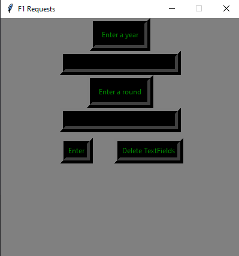

# F1Requests (Work in Progress)
-Using the ergast api to pull information about past F1 races

-As of right now you can enter details into the GUI and it will make a pull request from the ergast api website and write the xml file to data.xml
 

<style
  .center {
  display: block;
  margin-left: auto;
  margin-right: auto;
  width: 50%;
}
<style/>

