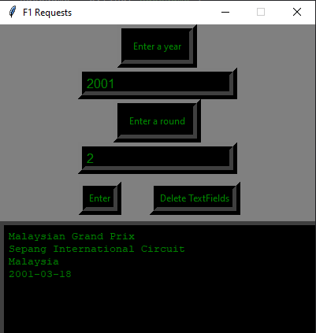

# F1Requests (Work in Progress)

-Using the ergast api to pull information about past F1 races

-As of right now you can enter details into the GUI and it will make a pull request from the ergast api website and write the xml file to data.xml
  
-The details of where the race took place and at what date will then be displayed
  

  
  
 
 

  

     
- BUGS: The data will only be displayed once certain parts of the XML are deleted (the first 3 lines) 
